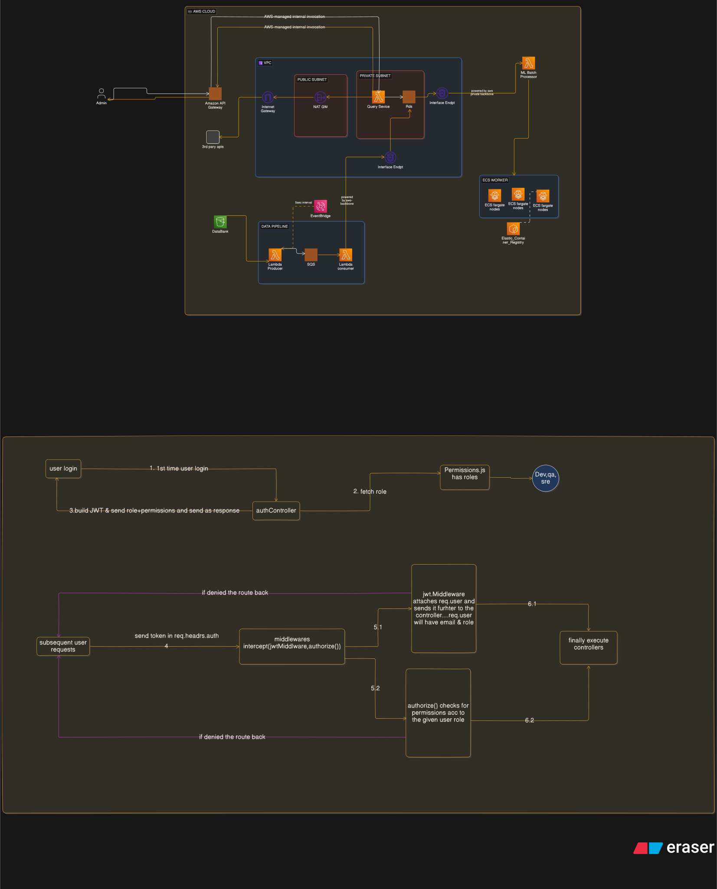

# LogStream Query Service

Backend query service for the LogStream dashboard. This service exposes authenticated APIs for reading logs, exploring cluster-specific log data, and managing incidents. It is built with Express, wrapped for AWS Lambda with `@vendia/serverless-express`, and uses PostgreSQL as the main data store with Redis for caching.

## What This Repository Does

This project acts as the backend for the LogStream UI.

It is responsible for:

- authenticating users
- attaching role-based access control to protected routes
- querying logs from PostgreSQL
- returning dashboard-friendly summaries and filtered log views
- fetching cluster-specific logs
- creating and reading incidents
- reducing repeated database reads with Redis caching

## Architecture At a Glance

The request flow is:

`Client -> API Gateway/HTTP API -> AWS Lambda -> Express routes -> Auth/authorization middleware -> Controllers -> PostgreSQL/Redis`

The diagram below shows the same high-level flow visually:

Main pieces:

- `Express` handles routing and middleware
- `AWS SAM` defines the Lambda deployment
- `PostgreSQL` stores users, logs, and incidents
- `Redis` caches repeated query results
- `JWT` is used for authenticated requests
- `Role matrix` controls what each role can access

## Core Features

- JWT-based authentication
- Role-based authorization for protected endpoints
- Redis caching for frequently requested data
- Google reCAPTCHA check during login

## Authentication and Authorization

Authentication and permissions are a central part of this service.

### Login flow

1. A user logs in with email, password, role, and `captchaData`.
2. The backend verifies the reCAPTCHA token.
3. The user's credentials are checked against the database.
4. A JWT token is created and returned.
5. The client sends that token in the `Authorization` header on future requests.

### Role-based access control

Roles are defined in [`backend/permissions.js`](backend/permissions.js). The current roles are:

- `sre`
- `dev`
- `qa`

Each role maps to permissions such as:

- `view_logs`
- `view_clusters`
- `manage_incidents.create`
- `manage_incidents.read`
- `manage_incidents.update`

The authorization middleware checks the user's role from the JWT and compares it against the role matrix before allowing access to a route.

### Current role behavior

- `sre` can view logs, view clusters, and manage incidents
- `dev` can view logs and manage incidents, but cannot view clusters
- `qa` can view logs and manage incidents, but cannot view clusters

Note: incident visibility is currently role-based, not user-specific. For example, all users with the same role can currently see incidents assigned to that role.

## API Overview

All routes are mounted under `/api/v1`.

## Tech Stack

- Node.js
- Express
- AWS Lambda
- AWS SAM
- PostgreSQL
- Redis

### Prerequisites

- Node.js 20+
- npm
- AWS SAM CLI
- Access to a PostgreSQL instance
- Access to a Redis instance

### Install dependencies

From the repository root:

cd backend
npm install

### Configuration

This service expects environment variables for database access.

| `DB_HOST` | PostgreSQL host |
| `DB_PORT` | PostgreSQL port |
| `DB_NAME` | PostgreSQL database name |
| `DB_USER` | PostgreSQL username |
| `DB_PASSWORD` | PostgreSQL password |

### Run locally

This project is set up as a serverless Express app, so the usual local flow is through AWS SAM:

sam build
sam local start-api

After that, the API can be tested locally through the SAM local endpoint.

### Deploy
sam build
sam deploy --guided

The Lambda configuration is defined in [`template.yaml`](template.yaml).

## Notes and Known Gaps

- The service currently uses raw SQL strings in several places. Parameterized queries would make this safer and easier to maintain.
- Some secrets and connection details should be moved fully into environment variables or a secret manager before treating this as production-ready.

## Who This README Is For

This README is mainly for:

- new contributors trying to understand the project quickly
- reviewers opening the repository for the first time
-  coming back after a few weeks and needing fast context
